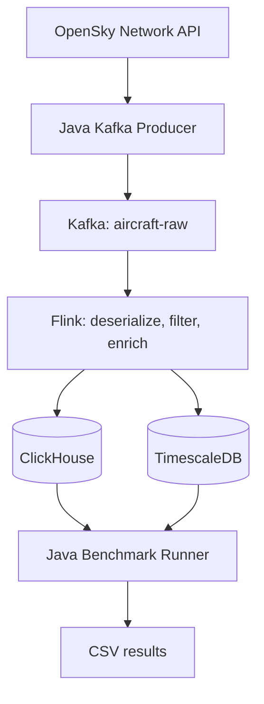

# Real-Time Aircraft Streaming and Analytics

A Java data pipeline that ingests live aircraft observations from the OpenSky Network, processes them with Apache Kafka and Apache Flink, and stores the processed stream in ClickHouse and TimescaleDB. A separate benchmark compares analytical query performance on the collected data.

Developed by **Daniel Jovanovski** for the **Big Data Mining** course at **FINKI**.

Research topic: *Real-Time Aircraft Data Processing and Analytics: A Performance Comparison of ClickHouse and TimescaleDB.*

## Architecture



- **Ingestion:** the producer fetches aircraft state vectors, publishes JSON records keyed by `icao24`, and waits 10 seconds after each fetch/send cycle.
- **Processing:** Flink removes observations without latitude or longitude, converts velocity to km/h and barometric altitude to feet, assigns a flight phase, and adds a processing timestamp.
- **Storage:** two JDBC sinks write to `aircraft.processed_aircraft_events`, using batches of 1,000 records per sink writer.
- **Evaluation:** the benchmark executes ten analytical queries against both databases and exports timing statistics.

Flight phases use a simple rule: `GROUND` when on the ground, `CLIMBING` above +1 m/s vertical rate, `DESCENDING` below −1 m/s, and `LEVEL` otherwise, including when vertical rate is unavailable.

## Repository contents

| Path | Purpose |
|---|---|
| [`kafka-producer/`](kafka-producer/) | OpenSky API client, aircraft model, and Kafka producer |
| [`flink-processing/`](flink-processing/) | Stream deserialization, filtering, enrichment, and database sinks |
| [`benchmark/`](benchmark/) | Analytical SQL workload and Java benchmark runner |
| [`docker-compose.yml`](docker-compose.yml) | Kafka, Flink, databases, and Conduktor services |
| [`benchmark/benchmark-raw.csv`](benchmark/benchmark-raw.csv) | Individual measured query runs |
| [`benchmark/benchmark-summary.csv`](benchmark/benchmark-summary.csv) | Aggregated timing statistics |
| [`benchmark/benchmark-metadata.csv`](benchmark/benchmark-metadata.csv) | Dataset counts, timestamp bounds, and benchmark settings |

Each Java module has its own Gradle build and wrapper.

## Technology stack

Versions below reflect the committed configuration.

| Component | Version/configuration |
|---|---|
| Kafka broker | `confluentinc/cp-kafka:8.0.0`, single-node KRaft |
| Kafka Java client | `4.3.1` |
| Apache Flink | `2.2.0`, Java 21 container image |
| Flink Kafka connector | `5.0.0-2.2` |
| ClickHouse | `26.8.1.2041` |
| TimescaleDB | `2.29.2-pg17` |
| Conduktor Console | `1.47.0` |
| Conduktor metadata database | PostgreSQL 14 |
| Gradle wrapper | `8.10` |

The PostgreSQL 14 service supports Conduktor; the analytical PostgreSQL database is the separate TimescaleDB service.

## Running the pipeline

### 1. Prerequisites and clone

Install Docker with Docker Compose, a JDK compatible with the project dependencies (Java 21 matches the Flink containers), and IntelliJ IDEA to launch the producer as currently configured. Internet access is required for dependencies, container images, and OpenSky requests.

```bash
git clone https://github.com/jovanovski262/aircraft-streaming-project.git
cd aircraft-streaming-project
chmod +x kafka-producer/gradlew flink-processing/gradlew benchmark/gradlew
```

The current OpenSky client sends unauthenticated requests. API availability and access limits may affect collection.

### 2. Start the infrastructure

Run from the repository root:

```bash
docker compose up -d
docker compose ps
```

Wait for the services to finish starting before creating the topic or submitting the job.

| Service | Host address |
|---|---|
| Kafka | `localhost:9092` |
| Conduktor Console | http://localhost:8080 |
| Flink dashboard | http://localhost:8081 |
| ClickHouse HTTP/JDBC | `localhost:8123` |
| ClickHouse native protocol | `localhost:9000` |
| TimescaleDB | `localhost:5434` |

Within Docker, Flink connects to `kafka:29092`, `clickhouse:8123`, and `timescaledb:5432`.

### 3. Prepare the database schemas

**Database initialization SQL is not currently included in this repository.** Docker Compose creates the database services and the `aircraft` databases, but the sinks do not create their destination tables.

Before running Flink, restore or create `processed_aircraft_events` in both databases using the experiment's schema. The ClickHouse table uses MergeTree; the TimescaleDB table must be configured as a hypertable on `event_timestamp`. Preserve the original sorting, partitioning, and indexing choices when reproducing the benchmark.

Both sinks expect these columns:

```text
icao24, callsign, origin_country, event_timestamp,
longitude, latitude, barometric_altitude, velocity,
heading, vertical_rate, on_ground, geometric_altitude,
squawk, position_source, category, velocity_kmh,
altitude_feet, flight_phase, processed_at
```

The exact DDL and the collected observation dataset are needed to reproduce the original experiment; neither is included in the current repository. The committed CSV files contain benchmark results and metadata, not the underlying aircraft observations.

### 4. Create the Kafka topic

```bash
docker compose exec kafka kafka-topics \
  --bootstrap-server kafka:29092 \
  --create --if-not-exists \
  --topic aircraft-raw \
  --partitions 3 \
  --replication-factor 1
```

### 5. Build and submit the Flink job

From the repository root:

```bash
(cd flink-processing && ./gradlew clean shadowJar)

docker compose exec flink-jobmanager mkdir -p /opt/flink/usrlib

docker compose cp \
  flink-processing/build/libs/flink-processing-1.0-SNAPSHOT-all.jar \
  flink-jobmanager:/opt/flink/usrlib/flink-processing.jar

docker compose exec flink-jobmanager flink run -d \
  -c com.mk.ukim.finki.AircraftFlinkJob \
  /opt/flink/usrlib/flink-processing.jar
```

Check the job in the Flink dashboard. Processed records and sink errors can be inspected with:

```bash
docker compose logs -f flink-taskmanager
```

### 6. Run the producer

Open `kafka-producer` as a Gradle project in IntelliJ IDEA, allow dependencies to synchronize, and run the `main` method in:

```text
com.mk.ukim.finki.AircraftProducer
```

The producer's Gradle build currently applies only the Java plugin, so it does not provide a `./gradlew run` task. Use `AircraftProducer`, rather than the placeholder `Main` class.

## Running the benchmark

The reported experiment measured queries **after the producer and Flink ingestion were stopped**. It does not measure query latency under concurrent ingestion.

1. Stop the producer and allow the existing Kafka backlog to be processed.
2. Stop the Flink job after collection. Verify the stored datasets before benchmarking; partially filled sink batches and shutdown behavior can affect final counts.
3. Keep ClickHouse and TimescaleDB running.
4. Preserve the committed CSV files if you want to keep the original results: the runner overwrites its output files.
5. Run:

```bash
cd benchmark
./gradlew run
```

The runner checks that both datasets are nonempty and have matching total row counts, distinct aircraft counts, and minimum/maximum timestamps. These checks do not establish complete row-by-row equality.

For each query and database, it performs **5 warm-up runs** followed by **20 measured runs**. Database execution order alternates between queries, with a 500 ms pause between database measurements. Timings include JDBC execution, result retrieval, and consumption of every returned value; they are not server-only execution times.

Outputs include mean, median, minimum, maximum, sample standard deviation, and P95 latency in milliseconds. Result row counts are also recorded.

## Recorded dataset and results

The committed metadata records **996,059 observations** and **13,088 distinct aircraft** in each database. Observation timestamps span **September 18, 2026, 22:48:40–23:13:35 UTC**, a range of **1,495 seconds (24 minutes 55 seconds)**.

Mean timings from [`benchmark-summary.csv`](benchmark/benchmark-summary.csv):

| Query | Operation | ClickHouse (ms) | TimescaleDB (ms) | TS / CH mean ratio |
|---|---|---:|---:|---:|
| Q1 | Count all observations | 4.999 | 48.914 | 9.78× |
| Q2 | Count distinct aircraft | 28.027 | 1545.087 | 55.13× |
| Q3 | Observations by origin country | 19.190 | 85.475 | 4.45× |
| Q4 | Average velocity by origin country | 27.798 | 165.631 | 5.96× |
| Q5 | Flight phase distribution | 19.513 | 150.845 | 7.73× |
| Q6 | Observations per minute | 17.187 | 98.145 | 5.71× |
| Q7 | Average altitude per minute | 24.809 | 132.043 | 5.32× |
| Q8 | Recent 10-minute time-range aggregation | 21.086 | 96.642 | 4.58× |
| Q9 | Trajectory of most observed aircraft | 60.020 | 244.505 | 4.07× |
| Q10 | Latest observation for every aircraft | 111.483 | 2471.474 | 22.17× |

ClickHouse had lower mean latency for all ten queries in this run. The largest ratio was approximately **55.1×** for distinct-aircraft counting (Q2), followed by **22.2×** for the latest observation per aircraft (Q10).

These results describe this dataset, hardware, schemas, indexes, and SQL implementations. They are not a general ranking of the databases. Warm-up runs were used, and the runner does not reset database or operating-system caches between measurements.

## Implementation notes and limitations

- The current configuration is intended for a local university experiment. Connection settings and demonstration credentials are hardcoded in Compose and Java; changing Compose credentials alone does not update the sinks or benchmark runner. There is no automatic `.env` integration in the Java code.
- A newly submitted Flink job starts at the earliest available Kafka offsets. Re-submitting against populated destination tables can insert duplicate observations.
- The job does not configure checkpointing or transactional coordination between the sinks. Exactly-once delivery and atomic writes across both databases are not guaranteed.
- Q10 uses ClickHouse `argMax` and PostgreSQL `DISTINCT ON`. Null handling and equal-timestamp ties can produce different values; the runner compares output row counts, not full result equality.
- Docker-managed named volumes retain Kafka and database data independently of Git.

## Stopping the services

```bash
docker compose down
```

This stops and removes the containers while preserving named volumes. Avoid adding `-v` if you want to retain the collected data.

## Author

**Daniel Jovanovski**

Faculty of Computer Science and Engineering (FINKI)

Big Data Mining Project
